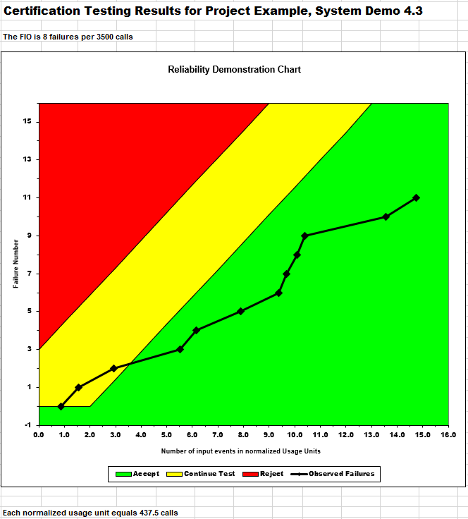
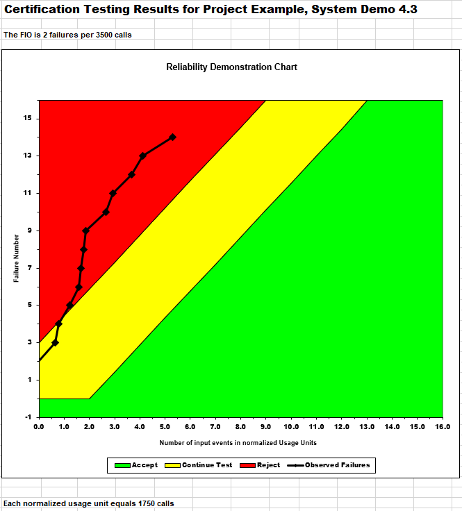

**SENG 438- Software Testing, Reliability, and Quality**

**Lab. Report \#5 – Software Reliability Assessment**

| Group \#: 13     |  |
| -------------- | --- |
| Student Names: |     |
| Tien Dat Johny Do         |     |
| Tommy Dinh              |     |
| Stuart Johnstone               |     |
| Sina Tavakol Moghaddam              |     |

# Introduction
This lab introduced our group to the analysis of integration test data and various software for reliability assessment tools. Within the first part we explored the reliability grouth testing with either START or C-SFRAT which would help us under visualize and learn about reliable growth testing. Moreoever, in part 2, we would be using RDC(reliability demonstration chart in order to learn what the trend of reliability of the system is measured to be. In all this lab helped introduce us to integration testing with START/C-SFRAT and RDC.

# Assessment Using Reliability Growth Testing 
Our group decided to use the Failure Document 2 in order to use the SRTAT method. We turned Failure Document into a text file and into the proper format in order to use the SRTAT. Below are encompasses our plots and range. 

### Range analysis & Plots for failure rate and Reliability of the SUT for the test data provided
## Geometric Model of Dataset 2
### Geometric Prediction

This graph represents the geometric model of for the dataset 2. We can see the raw data as well as the predicition line where the failure number increases as time increases as well. The predicition is relatively similar due to the data points slowly back and forth for its time between failure.  

### Geometric Model Results

In our model results for geometric model, our the results displays the estimate of the model as well as the 95% confidnece interval from the start and then end points of the dataset. In addition it will contain the proportional constant, initial hazard rate,  Meant-Time-Before-Next-Failure (MTBNF) and the current purification level. 

### Littlewood and Varral's Bayesian Reliability Model Prediction

This graph represents the Littlewood and Varral Bayesian model of for the dataset 2. We can see the raw data as well as the predicition line where the failure number increases as time increases as well. This graph is quite similar to the geometric model but slightly different in the kolmogorov distance. 

### Littlewood and Varral's Bayesian Reliability Model Results

In our model results for the Littlewood and Varral Bayesian model of for the dataset 2. This model differed where the results ouputted where formatted to alpha, iteration count, Beta0, Beta1, and Optimum. This model our group changed the parameters of Beta0 and Beta1  in order to find a better predicition of the dataset.

* As a note : The Jelinski Moranda De-Eutrophication, John Musa's Basic Execution Time, John Musa's Logarithmic Poisson, and Non-homogeneous Posisson Models were not applicable for our Dataset hence we only test Geometric and Littlewood and Varral's Bayesian Models

### A discussion on decision making given a target failure rate 
Our group found that in the SRTAT, we could not use the Laplace formula within the textfile but only with the excel file which we could not import into SRTAT, but we have notified our TA that we have done exploratory testing with different parameters in order to find plots and results for our dataset in order to select a range. Although we could not use Laplace in our testing, our group made exploratory test on the second model of Littlewood and Varral's. Here we tried to input different inputs for Beta0 and Beta1 in order to find parameters that will yield more accurate result. Our group found that the changes in the parameters lead to better accuracy in failure predicitions while inputting the data. 

### A discussion on the advantages and disadvantages of reliability growth analysis

#### Advantages
* RGT allows for early detection of defects within a system. This is advantageous because it allows developers of the system to fix their mistakes during the development process.
* Since RGT allows for early detection, this will also save money long term since there will not be the need for as many repairs and fixes.
* RGT uses a data-driven approach which is beneficial because this allows the system to improve reliability based on the results given.

#### Disadvantages
* RGT requires lots of resources such as money, time, and people/systems to collect and analyze the given data.
* RGT is not able to help detect future problems within a system, only problems that are occurring at what the current state of the system is at that very moment.
* RGT is able to find defects, but it only finds the defects, not what the root cause of the defect is.

# Assessment Using Reliability Demonstration Chart 

## 3 Plots for MTTFmin, twice, and half of it for the Dataset

### MTTFmin 

In this figure above, it showcases of MTTFmin. We were about to find MTTFmin through making the parameters of maximum acceptable number of failures to 4 , per number of input events to 3500 meaning that we have the MTTF = 4/3500 = 0.00114286. Here our FIO is 4 failures per 3500 calls. Each normalized usage unit equals 875 calls. Here our dataset is within the "Continute Test" parameters mostly reaching meaning that the SUT will need more testing to make a determination 

### Twice MTTF
 

In this figure above, it showcases of Twice MTTF. We were about to find  twiceMTTF through making the parameters of maximum acceptable number of failures to 8 , per number of input events to 3500 meaning that we have the MTTF = 8/3500 = 0.00228571.Here our FIO is 8 failures per 3500 calls. Each normalized usage unit equals 437.5 calls. Here our dataset is mostly within the "Accept" parameters meaning that the SUT will achieve its failure intensity objective. 
### Half MTTF

In this figure above, it showcases of MTTFmin. We were about to find Half MTTF through making the parameters of maximum acceptable number of failures to 2 , per number of input events to 3500 meaning that we have the MTTF = 2/3500 = 0.00057143. Here our FIO is 2 failures per 3500 calls. Each normalized usage unit equals 1750 calls. Here our dataset is mostly within the "Reject" parameters meaning that the SUT cannot achieve its failure intensity objective.

### Evaluation and justification of the decision of the MTTFmin

In order to find MTTFmin, each group of pair testers would first input our data set into the "Failure Data" tab of the excel and each pair would evaluate different values of MTTF from adjusting each parameter of the Failure Intensity Objective (FIO). In our dataset, the number of failure counts was only up to 65, in results our group found that the maximum acceptable number of failures would have to be relatively small. Next one pair found thtat the per number of inputs events could be around 2500-5000 with a maximum acceptable number of failures of 4 in order to output the whole graph clearly with 22 variable points within the continue testing parameters. Our MTTFmin would end up being 4/3500 = 0.00114286. In brief, our group was able to find our MTTFmin through exploratory testing with different parameters in order to fit the dataset.

### Dicussion of advantages and disadvantages of RDC
#### Advantages
* RDC is able to display graphs and data, making it easy to see the reliability of a system and measure if reliability requirements were met.
* Since RDC has metrics that measure if reliability requirements were met, it can be used to ensure that customer expectations are met.
* RDC follows a very well planned and structured approach meaning that the tests are very consistent.

#### Disadvantages
* Lots of tests need to be done in order to obtain reliable data. This can be very costly and time-consuming.
* RDC does not find root causes of defects and failures within a system, meaning that the problem can reoccur or occur in other places.
* RDC does not account for all potential failures and factors that can affect reliability and reliability requirements. 

# Comparison of Results
From our first RGT testing, we found that the geometric model was a better fit for our dataset. Where the initial harzard rate was around 0.001950 where our RDC testing MTTF would be similar at 0.00114286. Here both techinques of RGT and RDC determined that the dataset 2  has a linear tread where the number of failures increase as time increases as well. In our RDC, our data set sits within the "continue phase" where the SUT considered needs to progress in testing in order for the SUT to be considered acceptable.

# Discussion on Similarity and Differences of the Two Techniques
The two different techniques used in this lab were Reliability Growth Testing (RGT) and Reliability Demonstration Chart (RDC). Both of these methods are used to test the reliability of a system. 

### Similarties
* Both techniques are utilized to meet the reliability requirements of a system.
* Both techniques require testing and furhter analysis in order to determin the SUT's reliability. 

### Differences
* RGT and RDC use different methods to determine the reliability of a system. RGT uses two different metrics, Failure Intensity (FI) or Failure Rate (FR). These metrics will measure how the reliability will improve over time. RDC uses two different metrics, Time Between Failures (MTBF) or Probability of Failure (PoF). These metrics will determine if a system meets the reliability requirements. 
* RGT is used in discovering of defects while designing and developing the system. RDC is used to demonstrate that a system meets reliability requirements.
* RGT is typically used throughout the development of the system. RDC is typically used once the development of the system is finished.
* RGT does not have any passing criteria, since it is used to find and remove defects during the development phase. RDC does have a passing criteria, since it is testing if the system meets the reliability requirements. 

# How the team work/effort was divided and managed
To ensure that the group’s productivity was optimized, Tommy and Tien Dat worked on the Reliability and Growth Testing while Stuart and Sina worked on the Reliability Demonstration Chart. Once these were completed, our group came together to discuss our findings and show each other how to use the techniques. In some parts such as Part 2 of the lab we all work in finding the right parameters for the MTTFmin in order to output a accurate graph for our dataset. Once this mutual learning was achieved, the group as a whole worked on the lab report together. 

# Difficulties encountered, challenges overcome, and lessons learned
1. First challenge was the learning how to use the Reliability Growth testing SRTAT as well as the inputs of the dataset 2. Our TA Sujesh told us to use excel in order to find the laplace transform for the parameters and input the formula into the sheet. Our group could not do find a way in order to import the excel file to the SRTAT. Here our group went through the route of exploratory testing in order to find our laplace transform and other range parameters. Here we were able to learn about laplace transform through our excel, but we had to use the text file for the SRTAT. 
2. Second challange was learning how to use the Reliability Demonstration Chart. Here some group members were new to excel functionality which made it a learning curve for how to use the RDC model. Our group was able to input the data for the Dataset 2 into the cells, but finding how to find MTTF as well as format the graph in a manner that it would change with different values for maximum acceptance failures. Here our group was able to familiarize ourselves with excel as well as familiarize ourselves with the RDC. 
3. Our third challenge was how to get the data into the correct format and understanding how the data is read through the each software. Our group found that it was a learning curve in order to format the data without any prior knowledge of input format. Here our group found it useful to find the instructions for the TA dicussion board. Lessong learned here, our group would've wanted to do more exploratory testing if we had more time I believe we woul've found a way to incorporated the datasets into our systems. 
  
# Comments/feedback on the lab itself
This lab started out to be confusing due to some application not working for different operating system and was a learning curve to learn about these new tools. With a bit more clarification on the instruction of how to use the datasets would be beneficial in order to complete the lab. The TA's were able to post instructions on how to use the datasets given to us and clarified how to format each dataset per method we used in order to complete the lab. Moreover, if further instructions were given in order to use the RDC tool, or some more class notes on the RDC, it would be useful. Overall it was a good lab to learn about integration reliability testing tools of RGT and RDC. 
