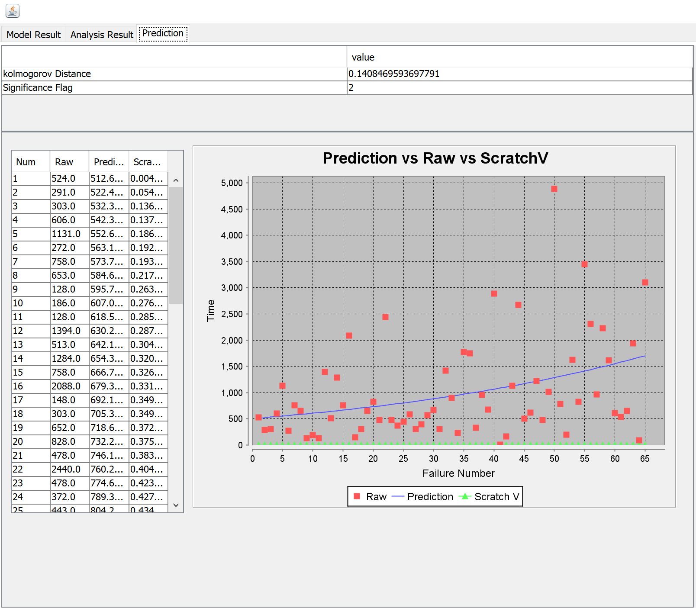
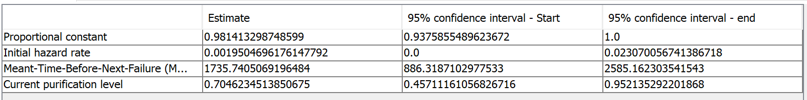
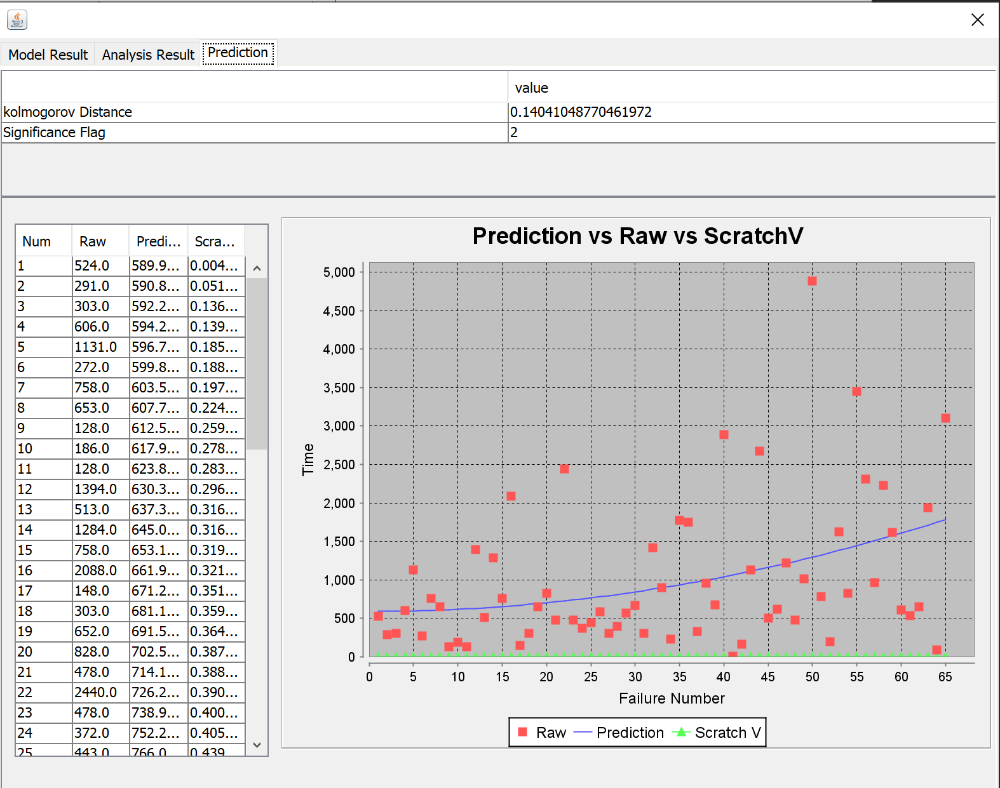
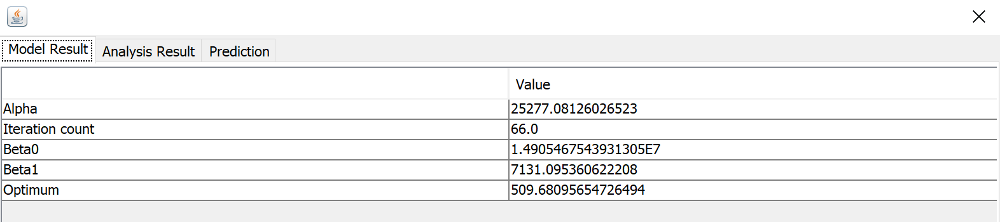

**SENG 438- Software Testing, Reliability, and Quality**

**Lab. Report \#5 – Software Reliability Assessment**

| Group \#: 13     |  |
| -------------- | --- |
| Student Names: |     |
| Tien Dat Johny Do         |     |
| Tommy Dinh              |     |
| Stuart Johnstone               |     |
| Sina Tavakol Moghaddam              |     |

# Introduction
This lab introduced our group to the analysis of integration test data and various software for reliability assessment tools. Within the first part we explored the reliability grouth testing with either START or C-SFRAT which would help us under visualize and learn about reliable growth testing. Moreoever, in part 2, we would be using RDC(reliability demonstration chart in order to learn what the trend of reliability of the system is measured to be. In all this lab helped introduce us to integration testing with START/C-SFRAT and RDC.

# Assessment Using Reliability Growth Testing 
Our group decided to use the Failure Document 2 in order to use the SRTAT method. We turned Failure Document into a text file and into the proper format in order to use the SRTAT

## Geometric Model of Dataset 2
### Geometric Prediction

### Geometric Model Results

### Littlewood and Varral's Bayesian Reliability Model Prediction

### Littlewood and Varral's Bayesian Reliability Model Results

# Assessment Using Reliability Demonstration Chart 

#

# Comparison of Results

# Discussion on Similarity and Differences of the Two Techniques

# How the team work/effort was divided and managed

# r

# Difficulties encountered, challenges overcome, and lessons learned
1. First challenge was the learning 
# Comments/feedback on the lab itself
This lab started out to be confusing due to some application not working for different operating system and was a learning curve to learn about these new tools. With a bit more clarification on the instruction of how to use the datasets would be beneficial in order to complete the lab. Overall it was a good lab to learn about integration reliability testing tools. 
