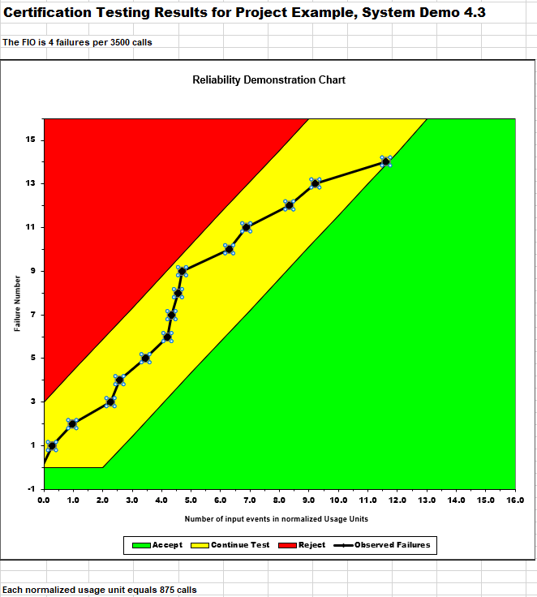

**SENG 438- Software Testing, Reliability, and Quality**

**Lab. Report \#5 – Software Reliability Assessment**

| Group \#: 13     |  |
| -------------- | --- |
| Student Names: |     |
| Tien Dat Johny Do         |     |
| Tommy Dinh              |     |
| Stuart Johnstone               |     |
| Sina Tavakol Moghaddam              |     |

# Introduction
This lab introduced our group to the analysis of integration test data and various software for reliability assessment tools. Within the first part we explored the reliability grouth testing with either START or C-SFRAT which would help us under visualize and learn about reliable growth testing. Moreoever, in part 2, we would be using RDC(reliability demonstration chart in order to learn what the trend of reliability of the system is measured to be. In all this lab helped introduce us to integration testing with START/C-SFRAT and RDC.

# Assessment Using Reliability Growth Testing 
Our group decided to use the Failure Document 2 in order to use the SRTAT method. We turned Failure Document into a text file and into the proper format in order to use the SRTAT

## Geometric Model of Dataset 2
### Geometric Prediction

### Geometric Model Results

### Littlewood and Varral's Bayesian Reliability Model Prediction

### Littlewood and Varral's Bayesian Reliability Model Results

* As a note : The Jelinski.Moranda De-Eutrophication, John Musa's Basic Execution Time, John Musa's Logarithmic Poisson, and Non-homogeneous Posisson Models were not applicable for our Dataset hence we only test Geometric and Littlewood and Varral's Bayesian Models

### Range analysis & Plots for failure rate and Reliability of the SUT for the test data provided

### A discussion on decision making given a target failure rate 

### A discussion on the advantages and disadvantages of reliability growth analysis

#### Advantages
* RGT allows for early detection of defects within a system. This is advantageous because it allows developers of the system to fix their mistakes during the development process.
* Since RGT allows for early detection, this will also save money long term since there will not be the need for as many repairs and fixes.
* RGT uses a data-driven approach which is beneficial because this allows the system to improve reliability based on the results given.

#### Disadvantages
* RGT requires lots of resources such as money, time, and people/systems to collect and analyze the given data.
* RGT is not able to help detect future problems within a system, only problems that are occurring at what the current state of the system is at that very moment.
* RGT is able to find defects, but it only finds the defects, not what the root cause of the defect is.

# Assessment Using Reliability Demonstration Chart 

## 3 Plots for MTTFmin, twice, and half of it for the Dataset

### MTTFmin 

In this figure above, it showcases of MTTFmin. We were about to find MTTFmin through making the parameters of maximum acceptable number of failures to 4 , per number of input events to 3500 meaning that we have the MTTF = 4/3500 = 0.00114286. Here our FIO is 4 failures per 3500 calls. Each normalized usage unit equals 875 calls. Here our dataset is within the "Continute Test" parameters mostly reaching meaning that the SUT will need more testing to make a determination 

### Twice MTTF
 

In this figure above, it showcases of Twice MTTF. We were about to find  twiceMTTF through making the parameters of maximum acceptable number of failures to 8 , per number of input events to 3500 meaning that we have the MTTF = 8/3500 = 0.00228571.Here our FIO is 8 failures per 3500 calls. Each normalized usage unit equals 437.5 calls. Here our dataset is mostly within the "Accept" parameters meaning that the SUT will achieve its failure intensity objective. 
### Half MTTF

In this figure above, it showcases of MTTFmin. We were about to find Half MTTF through making the parameters of maximum acceptable number of failures to 2 , per number of input events to 3500 meaning that we have the MTTF = 2/3500 = 0.00057143. Here our FIO is 2 failures per 3500 calls. Each normalized usage unit equals 1750 calls. Here our dataset is mostly within the "Reject" parameters meaning that the SUT cannot achieve its failure intensity objective.

### Evaluation and justification of the decision of the MTTFmin

In order to find MTTFmin, each group of pair testers would first input our data set into the "Failure Data" tab of the excel and each pair would evaluate different values of MTTF from adjusting each parameter of the Failure Intensity Objective (FIO). In our dataset, the number of failure counts was only up to 65, in results our group found that the maximum acceptable number of failures would have to be relatively small. Next one pair found thtat the per number of inputs events could be around 2500-5000 with a maximum acceptable number of failures of 4 in order to output the whole graph clearly with 22 variable points within the continue testing parameters. Our MTTFmin would end up being 4/3500 = 0.00114286 

### Dicussion of advantages and disadvantages of RDC
#### Advantages
* RDC is able to display graphs and data, making it easy to see the reliability of a system and measure if reliability requirements were met.
* Since RDC has metrics that measure if reliability requirements were met, it can be used to ensure that customer expectations are met.
* RDC follows a very well planned and structured approach meaning that the tests are very consistent.

#### Disadvantages
* Lots of tests need to be done in order to obtain reliable data. This can be very costly and time-consuming.
* RDC does not find root causes of defects and failures within a system, meaning that the problem can reoccur or occur in other places.
* RDC does not account for all potential failures and factors that can affect reliability and reliability requirements.

# Comparison of Results

SOmething

# Discussion on Similarity and Differences of the Two Techniques
The two different techniques used in this lab were Reliability Growth Testing (RGT) and Reliability Demonstration Chart (RDC). Both of these methods are used to test the reliability of a system. 

## Similarties
* Both techniques are utilized to meet the reliability requirements of a system.
* Both techniques are must test and analyze the system in order to evaluate the reliability.

## Differences
* RGT and RDC use different methods to determine the reliability of a system. RGT uses two different metrics, Failure Intensity (FI) or Failure Rate (FR). These metrics will measure how the reliability will improve over time. RDC uses two different metrics, Time Between Failures (MTBF) or Probability of Failure (PoF). These metrics will determine if a system meets the reliability requirements. 
* RGT is used to find and remove defects while designing and developing the system. RDC is used to demonstrate that a system meets reliability requirements.
* RGT is typically used throughout the development of the system. RDC is typically used once the development of the system is finished.
* RGT does not have any passing criteria, since it is used to find and remove defects during the development phase. RDC does have a passing criteria, since it is testing if the system meets the reliability requirements. 

# How the team work/effort was divided and managed
To ensure that the group’s productivity was optimized, Tommy and Tien Dat worked on the Reliability and Growth Testing while Stuart and Sina worked on the Reliability Demonstration Chart. Once these were completed, our group came together to discuss our findings and show each other how to use the techniques. Once this mutual learning was achieved, the group as a whole worked on the lab report together.

# Difficulties encountered, challenges overcome, and lessons learned
1. First challenge was the learning 
# Comments/feedback on the lab itself
This lab started out to be confusing due to some application not working for different operating system and was a learning curve to learn about these new tools. With a bit more clarification on the instruction of how to use the datasets would be beneficial in order to complete the lab. Overall it was a good lab to learn about integration reliability testing tools. 
